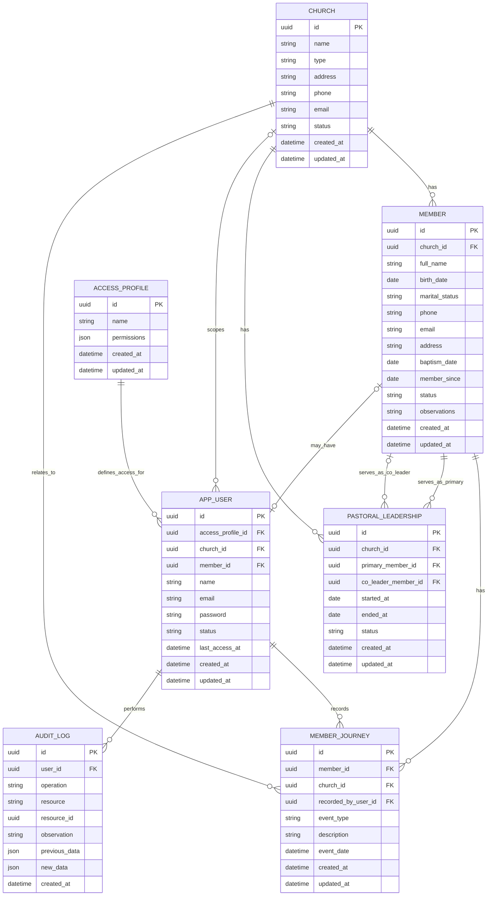

# Modelo inicial de dados

### Observações da modelagem

#### Identificadores
Todas as entidades utilizam UUID como chave primária.

O uso de UUID reduz a previsibilidade dos identificadores e facilita a geração de IDs sem depender de uma sequência centralizada. Ainda assim, regras de unicidade do negócio devem ser definidas separadamente.

#### Igreja sede

Cada instalação do sistema representa um único ministério.

A entidade CHURCH representa tanto a igreja sede quanto as congregações vinculadas. O campo type diferencia os valores:

- `HEADQUARTERS`
- `CONGREGATION`

Deve existir apenas uma igreja do tipo `HEADQUARTERS` por instalação.

#### Status das igrejas

O campo status da entidade CHURCH pode assumir inicialmente os valores:

- ACTIVE
- CLOSED

Uma igreja encerrada não deve ser removida definitivamente, pois seus membros, lideranças e históricos precisam continuar disponíveis.

#### Membros

Todo membro deve estar vinculado a uma igreja por meio de `church_id`.

Essa igreja pode ser a sede ou uma congregação.

O campo status pode assumir inicialmente os valores:

- `ACTIVE`
- `INACTIVE`

A inativação de um membro não deve apagar seu cadastro nem seu histórico.

#### Liderança pastoral

A entidade `PASTORAL_LEADERSHIP` representa quem é ou foi responsável por uma igreja durante determinado período.

O campo `primary_member_id` é obrigatório e representa o responsável principal.

O campo `co_leader_member_id` é opcional, permitindo representar tanto uma liderança individual quanto a liderança exercida por um casal.

`primary_member_id` e `co_leader_member_id` não podem apontar para o mesmo membro.

O campo `ended_at` permanece vazio enquanto a liderança estiver ativa. Registros de lideranças anteriores devem ser preservados.

#### Usuários e membros

A entidade `APP_USER` representa uma pessoa com acesso ao sistema.

Um usuário não é necessariamente um membro. Por isso, o campo `member_id` é opcional.

Quando preenchido, o campo vincula a conta de acesso ao cadastro correspondente em `MEMBER`.

##### Escopo do usuário

O campo `church_id` em `APP_USER` é opcional.

Quando preenchido, indica que o usuário atua no escopo de uma igreja específica.

Quando não preenchido, pode indicar que o usuário possui acesso geral à instalação, desde que seu perfil de acesso permita esse comportamento.

O escopo final deve ser sempre determinado em conjunto com o `ACCESS_PROFILE`.

#### Senha

O campo password deve armazenar somente o hash da senha.

A senha original nunca deve ser armazenada nem registrada em logs ou auditorias.

#### Status do usuário

O campo status de `APP_USER` pode assumir inicialmente os valores:

- `ACTIVE`
- `INACTIVE`

O campo `last_access_at` é opcional e deve ser atualizado após uma autenticação bem-sucedida.

#### Perfis e permissões

A entidade `ACCESS_PROFILE` define o nível de acesso dos usuários.

No MVP, o campo permissions pode ser armazenado como JSON, relacionando cada módulo a um nível de acesso.

Os níveis iniciais podem ser:

- `FULL`
- `READ`
- `NONE`

Caso as regras se tornem mais complexas, as permissões poderão futuramente ser separadas em uma estrutura relacional.

#### Jornada do membro

A entidade `MEMBER_JOURNEY` registra acontecimentos relevantes da vida do membro dentro da igreja.

Ela representa eventos do domínio, como:

- cadastro inicial;
- batismo;
- mudança de igreja;
- alteração de status;
- início ou encerramento de liderança.

Ela não deve ser utilizada como registro técnico de auditoria.

O campo `church_id` indica em qual igreja o acontecimento ocorreu, preservando o contexto mesmo que o membro seja transferido posteriormente.

#### Auditoria

A entidade `AUDIT_LOG` registra operações realizadas pelos usuários no sistema.

Ela deve armazenar informações como:

- usuário responsável;
- tipo de operação;
- recurso afetado;
- identificador do registro afetado;
- data e hora da ação;
- dados anteriores e novos, quando aplicável.

Os campos `previous_data` e `new_data` são opcionais e não devem armazenar informações sensíveis, como senhas, tokens ou segredos.

#### Datas de criação e atualização

Todas as entidades mutáveis possuem os campos:

- `created_at`
- `updated_at`

`created_at` representa o momento em que o registro foi criado.

`updated_at` representa a última alteração realizada no registro.

Em registros imutáveis, como `AUDIT_LOG`, possuem apenas `created_at`.